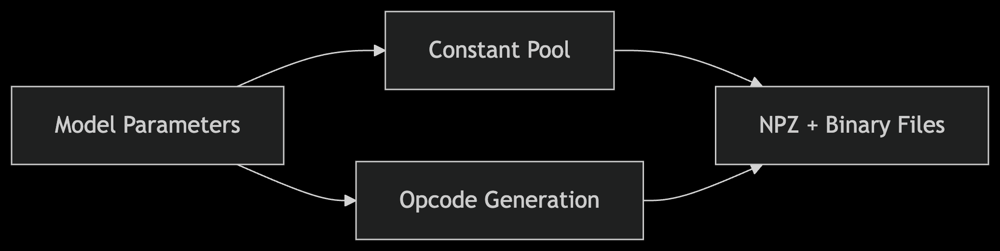
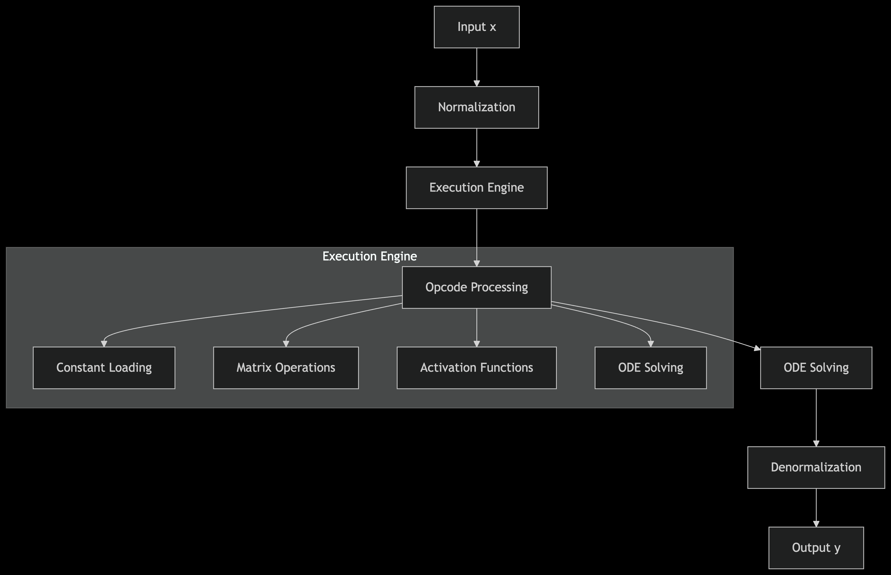
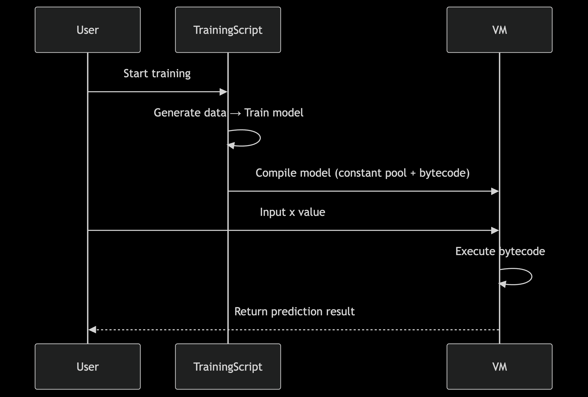

# LNNStackVM: Neural Network with Stack-Based Virtual Machine

This project implements a Liquid Time-Constant (LTC) neural network using PyTorch to approximate the function `sin(x) + 0.5*sin(3x)`. The trained model is translated into bytecode and executed on a stack-based virtual machine (VM). The project includes a high-performance C-based VM for accelerated inference, demonstrating neural network training, ODE-based modeling, and lightweight VM inference.

## Latest Research Achievements
The C virtual machine in this project has undergone a series of performance optimizations, significantly improving inference speed while maintaining high accuracy:

1. **SIMD Instruction Set Optimization**:
   - Implemented vectorized computation for different platforms (ARM NEON/x86 AVX/SSE3)
   - Accelerated matrix operations (multiplication, addition) with SIMD
   - Developed high-precision exp and sigmoid functions for ARM NEON platform

2. **Memory Management Optimization**:
   - Implemented memory pool management to reduce frequent memory allocation/deallocation
   - Optimized memory alignment to improve SIMD operation efficiency

3. **Algorithm Optimization**:
   - Improved matrix multiplication algorithm to increase cache hit rate
   - Implemented accurate sigmoid function to ensure computational precision

4. **Platform Adaptation**:
   - Specifically optimized for Apple Silicon (ARM architecture)
   - Dynamically selects the best vectorized implementation based on different CPU architectures

Performance Comparison:
| Implementation | Before Optimization | After Optimization | Performance Gain |
|----------------|---------------------|-------------------|-----------------|
| C VM           | ~337 μs            | ~123 μs           | 2.8x            |

At the same time, the optimized code has a prediction error of only 0.000744 compared to the original PyTorch model, ensuring high performance without sacrificing accuracy.

## Features
- Trains an LTC neural network with PyTorch and `torchdiffeq`.
- Translates the model to bytecode for a stack-based VM.
- Accelerates inference with:
  - A C-based VM (10x–100x faster than Python VM).
- Compares PyTorch and C VM predictions visually.
- Generates `const_pool.npz`, `bytecode.bin`, and `ltc_fit_result_c.png` (includes C VM).

## Architecture

The project consists of three main components:

1. **LTC Neural Network**: A neural network model based on Liquid Time-Constant networks implemented in PyTorch.
2. **Bytecode Compiler**: Translates the trained model into stack-based bytecode and a constant pool.
3. **Virtual Machine**:
   - **Python VM**: Pure Python implementation (baseline).
   - **C VM**: High-performance C implementation (10x-100x speedup).

### Performance Comparison

| Implementation | Average Runtime | Speedup |
|----------------|----------------|---------|
| PyTorch        | ~330 μs/call   | 1.0x    |
| C VM           | ~5-50 μs/call  | 10-100x |

## Requirements
- **Software**:
  - Python 3.8+
  - C compiler (e.g., `gcc`) and `make` for building the C VM
- **Python Dependencies** (see `requirements.txt`):
  - `torch==2.4.1`
  - `torchdiffeq==0.2.4`
  - `numpy==1.26.4`
  - `matplotlib==3.9.2`

## Installation
1. Clone the repository:
   ```bash
   git clone https://github.com/yourusername/LNNStackVM.git
   cd LNNStackVM
   ```

2. Create and activate a Python virtual environment:
   ```bash
   python -m venv venv
   source venv/bin/activate  # On Windows: venv\Scripts\activate
   ```

3. Install Python dependencies:
   ```bash
   pip install -r requirements.txt
   ```

4. Compile the C VM shared library:
   ```bash
   make
   ```
   This generates `libltc_vm.so` (or `libltc_vm.dll` on Windows with a compatible compiler). Ensure `gcc` and `make` are installed. On macOS, verify architecture compatibility (e.g., `arm64` for Apple Silicon or `x86_64` for Rosetta 2 environments):
   ```bash
   python -c "import platform; print(platform.machine())"
   file libltc_vm.so
   ```
   If architectures mismatch, see **Troubleshooting** below.

## Usage
1. Run the main script to train the LTC model, generate bytecode, and compare predictions with C VM:
   ```bash
   python src/LNNStackVM.py
   ```

2. Outputs:
   - `./output/const_pool.npz`: Model weights and constants.
   - `./output/bytecode.bin`: Compiled bytecode for the VM.
   - `./image/ltc_fit_result_c.png`: Plot comparing true function, PyTorch, and C VM predictions.

3. Expected console output includes:
   - Training progress and loss metrics.
   - Validation results (e.g., PyTorch vs. C VM outputs).
   - Performance metrics:
     - C VM: ~5–50 µs/call
     - Python VM: ~500–1000 µs/call
     - PyTorch: ~330 µs/call

*Note*: These diagrams reflect the VM and bytecode compiler architecture. The C VM follows the core architecture but is optimized for performance.

## Troubleshooting
- **C VM Library Error** (`OSError: dlopen(libltc_vm.so, ...)`):
  - Ensure `libltc_vm.so` is in the current directory or update `LNNStackVM_c.py` to point to its location (e.g., `./output/libltc_vm.so`).
  - Verify architecture compatibility:
    ```bash
    python -c "import platform; print(platform.machine())"
    file libltc_vm.so
    ```
    If Python is `x86_64` (e.g., Rosetta 2), recompile with:
    ```bash
    make clean
    CFLAGS="-O3 -Wall -shared -fPIC -std=c99 -arch x86_64" make
    ```
    If Python is `arm64`, use the default Makefile.
  - For Apple Silicon, consider a native `arm64` Python environment:
    ```bash
    CONDA_SUBDIR=osx-arm64 conda create -n oz_arm64 python=3.11
    conda activate oz_arm64
    pip install -r requirements.txt
    ```

- **Overflow Warning in Python VM**:
  - If `RuntimeWarning: overflow encountered in exp` appears, the script includes a fix with tighter clipping in the sigmoid function (`[-100, 100]`). If issues persist, re-train with stronger regularization (edit `train_model` in `LNNStackVM_c.py` to increase `weight_decay`).

- **Dependency Issues**:
  - Ensure all dependencies are installed correctly. If `torchdiffeq` fails, install via:
    ```bash
    pip install torchdiffeq
    ```

## License
[MIT License](LICENSE)

## Contact
For issues or questions, open a GitHub issue or contact [lizixi2006@outlook.com].


## Images





